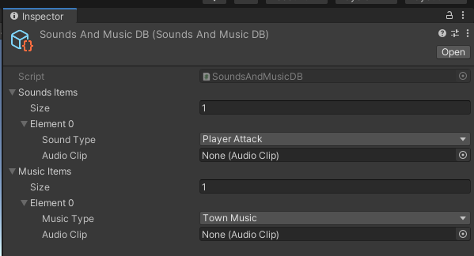
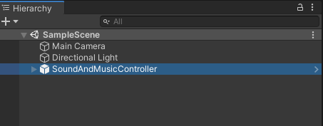
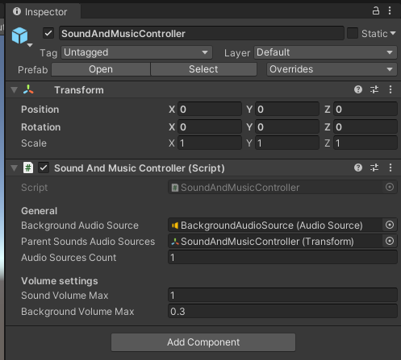

# SoundAndMusicSystem
Plugin for playing 2D sounds and music in games based on Unity.

[](https://github.com/RodionLodza/SoundAndMusicSystem/blob/master/LICENSE)
[](https://github.com/RodionLodza/SoundAndMusicSystem/watchers)
[](https://github.com/RodionLodza/SoundAndMusicSystem/stargazers)
<br />
<< [How to use](#how-to-use) | [Install](#how-to-install) | [Download](https://github.com/RodionLodza/SoundAndMusicSystem/raw/master/SoundAndMusicSystem.unitypackage) >>
<br />
<br />

## How to use
1. Create in Assets/SoundAndMusicSystem/Scripts/***SoundsAndMusicDB.cs*** new enums items for SoundType, MusicType.
```c#
namespace SoundAndMusic
{
    public enum SoundType
    {
        None = 0,
        PlayerAttack = 1
    }

    public enum MusicType
    {
        None = 0,
        TownMusic = 1
    }
}
```
2. Attach to Assets/SoundAndMusicSystem/Resources/**SoundsAndMusicDB.asset** some sounds and music with enum items.

3. Add to game scene Assets/SoundAndMusicSystem/Prefabs/**SoundAndMusicController.prefab** (better where the game is loading). You can set up audio sources count, sound and music volumes in inspector.


5. Use API **SoundAndMusicController** for playing sounds and music in your custom scripts.
```c#
using SoundAndMusic;
using UnityEngine;

public class SomeController : MonoBehaviour
{
    private void Start()
    {
        PlayBackgroudMusic();
        PlaySomeSound();
    }
    
    private void PlayBackgroudMusic()
    {
        SoundAndMusicController.Instance.PlayBackgroundMusic(MusicType.TownMusic);
    }
    
    private void PlaySomeSound()
    {
        SoundAndMusicController.Instance.PlaySoundAudio(SoundType.PlayerAttack);
    }
}
```
5. Also you can use another public API for volume setting (**SetSoundVolumeAudioSources**, **SetVolumeBackGroundMusic**) and for stopping all sounds/music (**StopAllAudioSource**).

## How to install
Download `SoundAndMusicSystem.unitypackage` and using UnityPackageManager.

## License
* [MIT](https://github.com/RodionLodza/SoundAndMusicSystem/blob/master/LICENSE)
